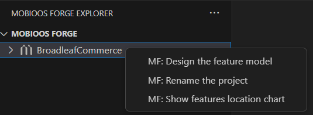
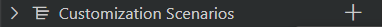
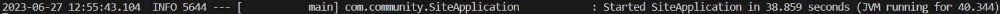

Readme:

Ce projet se base sur la démo de Broadleaf Commerce : https://github.com/BroadleafCommerce/DemoSite

------------------------------------------------------------------------------------------------------

## Prérequis :
- `Windows 10`
- `Java`
- `Maven`
- `Visual Studio Code`

- `Extension Vscode :`
    - `Mobioos Forge (extension id : Mobioos.mobioos-forge)`
    - `Extension Pack for Java (extension id : vscjava.vscode-java-pack)` 
    - `Dependency Analytics (extension id : redhat.fabric8-analytics)`

------------------------------------------------------------------------------------------------------

## Initialisation :
1. [Lire la documentation Mobioos](https://documentation.mobioos.ai/?id=what-is-mobioos-forge ) 

2. Cloner le github dans votre répertoire
3. Supprimer le fichier .git, car Mobioos tentera de créer une branche par variant créé sur ce repertoire.
4. Ouvrir le projet dans Vscode
5. Il y a 2 possibilités :

    - avoir les variants créés sur github -> Initialiser un répertoire github public 
    - avoir les variants créés en local -> ne rien faire


6. Cliquer dans la barre verticale à gauche sur le M de Mobioos Forge Explorer

7. Faire "Open Project" et cliquer sur le dossier de ce projet
8. Un onglet nommé "BroadleafCommerce" apparait

------------------------------------------------------------------------------------------------------

## Utilisation :
### Voir le diagramme du projet :
Dans l'onglet Mobioos Forge Explorer, clique droit sur "BroadleafCommerce" -> MF : Design the feature model. Un nouvel onglet s'ouvre avec le diagramme.


### Voir le mappage des fichiers :
Aller à BroadleafCommerce -> DemoSite -> site -> src\main et cliquer sur des fichiers. 
- pas de couleur = pas mappé (car essentiel ou pas d'importance côté utilisateur mais potentiellement inutilisé dans certains variants)
- une couleur = mappé, mettre la souris dessus et le nom de la feature correspondante à ce code apparaît.

### Créer un variant :
1. Dans l'onglet Mobioos Forge Explorer, aller tout en bas à "Customization Scenarios", cliquer sur le "+" tout à droite du titre

2. Entrer le nom de votre configuration et appuyer sur Entrer (Il faut un nom qui ne soit pas déjà pris. Pour voir la liste des configurations déjà créer, dérouler l'onglet "Customization Scenarios")
3. Un nouvel onglet apparait. Des cases sont déjà cochées, en jaune, c'est les éléments minimums nécessaires au bon fonctionnement du site. Vous pouvez rajouter des options en cliquant dessus.
(Certaines options dépendent d'autres, comme "Login" et "Customer Account Informations", donc si vous en voulez une, l'autre ce cochera automatiquement.)

4. Cliquer sur "Save"


5. Cliquer sur "Generate" : 2 possibilités en fonction de ce que vous avez choisi ci-dessus:
    - Si vous voulez votre variant sur une branche Github, verifier que votre branche actuel est Commit. Ecrire le nom de la branche qui va être créée et attendre que le variant soit push. (Ne pas se fier à la notification qui dit que c'est en cours de push, aller voir directement sur votre navigateur si c'est bon).
    Aller sur la branche voulu (rafraichir les infos de github pour faire apparaitre la branche sur Vscode)
    -  Si vous voulez votre variant en local, appuyer sur Echap quand le nom de la branche est demandée. Cliquer sur la pop up à droite qui propose d'ouvrir le projet créé dans Vscode. Le variant est par défaut stocké à Users\VotreUsername\mobioos-forge-customizations

8. Maintenant le variant créé :
- Soit ouvrer un terminal et entrer :
    ```shell
    cd DemoSite ; mvn clean install ; cd site ; mvn spring-boot:run ; mvn spring-boot:run ; mvn spring-boot:run
    ```
- Soit aller dans le répertoire "DemoSite", ouvrer un terminal et lancer la compilation avec 
    ```shell
    mvn clean install
    ``` 
    (Il est possible qu'elle échoue, relancer là le cas échéant. Si après plusieurs tentatives elle continue d'échouer, tenter de passer à la suite, parfois ça se lance quand même).

    Aller dans le dossier "site" et lancer dans un terminal :
    ```shell
    mvn spring-boot:run 
    ```
    (Si vous arrêter le programme avec un Ctrl + C le port reste ouvert, donc quand vous aller essayer de le relancer une erreur apparaitra, ce n'est pas grave, relancer la commande une nouvelle fois, 3 fois max).

8. Attendre que le lancement soit fini (20 à 50s)

9. Connexion au site client:

    [En http](http://localhost:8080) avec le port 8080

    [En https](https://localhost:8443) avec le port 8443


    Pour se connecter ailleurs voir les autres ports sur [le github de Broadleaf Commerce Demo](https://github.com/BroadleafCommerce/DemoSite#active-ports)
10. Shutdown le serveur :

    Ctrl + C dans le terminal[.](r.mtdv.me/BroadleafCommerceDocumentation)


