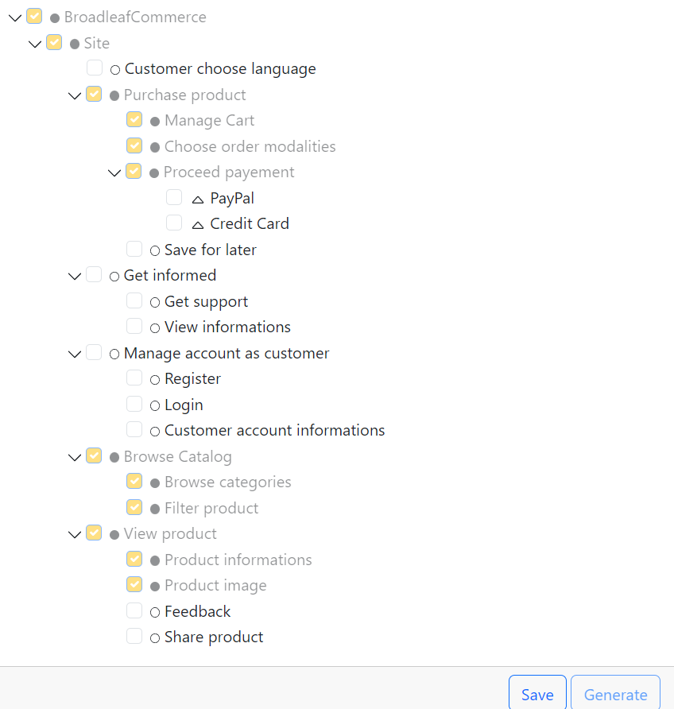

Readme:

This project is based on the Broadleaf Commerce demo: https://github.com/BroadleafCommerce/DemoSite

------------------------------------------------------------------------------------------------------

## Prerequisites:
- Windows 10 
- Ubuntu with :
    - libssl-dev :

        ```shell
        sudo apt install libssl-dev
        ```
    - libssl1.0.0 :

        Manualy download the package corresponding to your architecture ([amd64](http://security.ubuntu.com/ubuntu/pool/main/o/openssl1.0/libssl1.0.0_1.0.2n-1ubuntu5.13_amd64.deb) or [i386](http://security.ubuntu.com/ubuntu/pool/main/o/openssl1.0/libssl1.0-dev_1.0.2n-1ubuntu5.13_i386.deb)), then install the package using the sudo apt install command
- Java
- Maven
- Visual Studio Code

- Vscode Extension:
    - Mobioos Forge (extension id: Mobioos.mobioos-forge)
    - Extension Pack for Java (extension id: vscjava.vscode-java-pack) 
    - Dependency Analytics (extension id: redhat.fabric8-analytics)

------------------------------------------------------------------------------------------------------

## Initialization:
1. [Read the Mobioos documentation](https://documentation.mobioos.ai/?id=what-is-mobioos-forge ) 

2. Clone the GitHub repository to your directory
3. Delete the .git file, as Mobioos will attempt to create a branch for each variant created in this repository.
4. Open the project in Vscode
5. There are 2 options:

    - have the variants created on GitHub -> Initialize a public GitHub repository 
    - have the variants created locally -> do nothing


6. Click on the M of Mobioos Forge Explorer in the left vertical bar

7. A tab named "BroadleafCommerce" will appear

------------------------------------------------------------------------------------------------------

## Usage:
### View the project diagram:
In the Mobioos Forge Explorer tab, right-click on "BroadleafCommerce" -> MF: Design the feature model. A new tab will open with the diagram.


### View file mapping:
Go to BroadleafCommerce -> DemoSite -> site -> src\main and click on individual files. 
- no color = not mapped (because it's essential or not relevant to the user but potentially unused in certain variants)
- a color = mapped, hover over it and the corresponding feature name for that code will appear.

### Create a variant:
1. In the Mobioos Forge Explorer tab, scroll down to "Customization Scenarios" and click on the "+" icon on the right of the title

2. Enter the name of your configuration and press Enter (It should be a name that is not already taken. To see the list of already created configurations, expand the "Customization Scenarios" tab)
3. A new tab will appear. Some checkboxes are already checked in yellow, which are the minimum elements required for the site to function properly. You can add options by clicking on them.
(Some options depend on others, like "Login" and "Customer Account Informations," so if you want one, the other will be automatically checked.)

4. Click on "Save"

    Sometimes Mobioos fails to delete the previous variant with the same name. To delete it, go to
        ```
        Users\YourUsername\mobioos-forge-customizations
        ```


5. Click on "Generate": There are 2 possibilities depending on your choice above:
    - If you want your variant on a GitHub branch, make sure your current branch is committed. Enter the name of the branch that will be created and wait for the variant to be pushed. (Do not rely on the notification that says it is being pushed, go directly to your browser to check if it's done).
    Go to the desired branch (refresh the GitHub information to make the branch appear in Vscode)
    - If you want your variant locally, press Esc when prompted for the branch name. Click on the pop-up on the right that offers to open the created project in Vscode. The variant is by default stored at
    ```
    Users\YourUsername\mobioos-forge-customizations
    ```

8. Now that the variant is created, there are 2 options:
    - Quick: Open a terminal and enter:
        ```shell
        cd DemoSite ; mvn clean install ; cd site ; mvn spring-boot:run ; mvn spring-boot:run ; mvn spring-boot:run
        ```
    - Step-by-step: go to the "DemoSite" directory, open a terminal, and launch the compilation with
        ```shell
        mvn clean install
        ``` 
        (It may fail, relaunch it if necessary. If it continues to fail after several attempts, try moving on to the next step, sometimes it still launches.)

        Go to the "site" folder and launch in a terminal:
        ```shell
        mvn spring-boot:run 
        ```
        (If you stop the program with Ctrl + C, the port remains open, so when you try to relaunch it, an error will appear. It's not a problem, just relaunch the command again, maximum 3 times).

8. Wait for the launch to finish (20 to 50s)

9. Connect to the client site:

    [In http](http://localhost:8080) with port 8080

    [In https](https://localhost:8443) with port 8443


    For connecting elsewhere, see the other ports on [the Broadleaf Commerce Demo GitHub](https://github.com/BroadleafCommerce/DemoSite#active-ports)
10. Shutdown the server:

    Ctrl + C in the terminal[.](r.mtdv.me/BroadleafCommerceDocumentation)

    Then don't forget to confirm.
